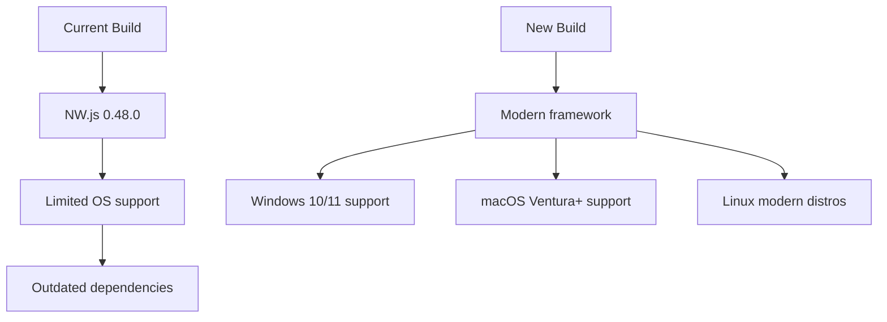
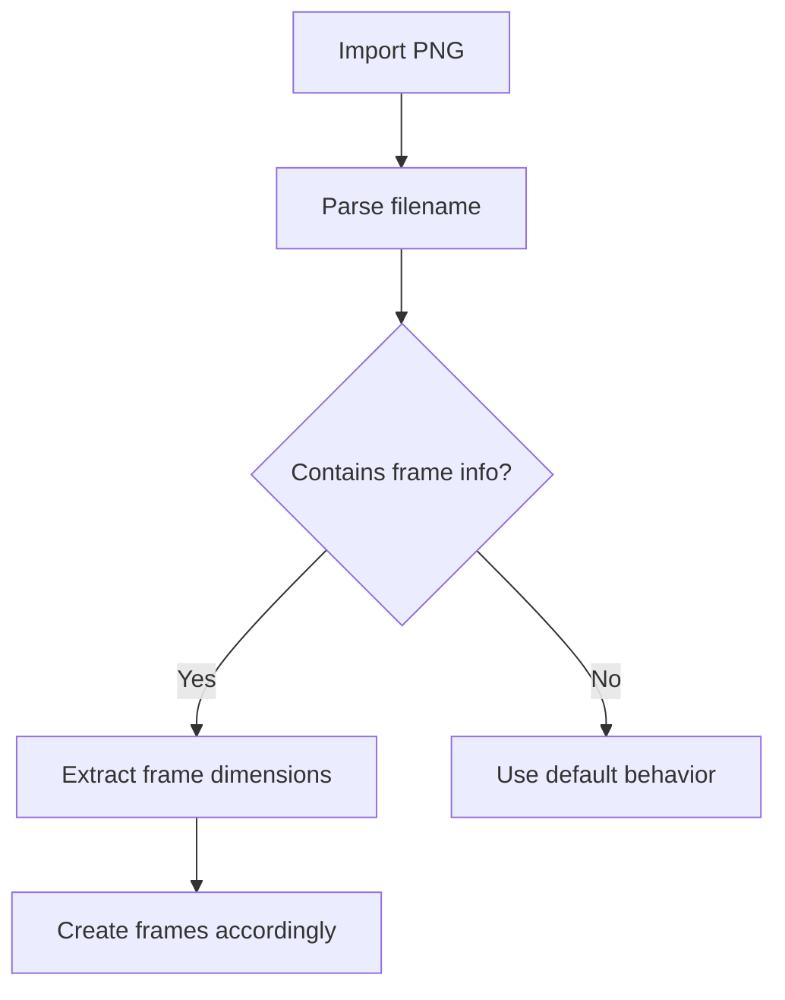
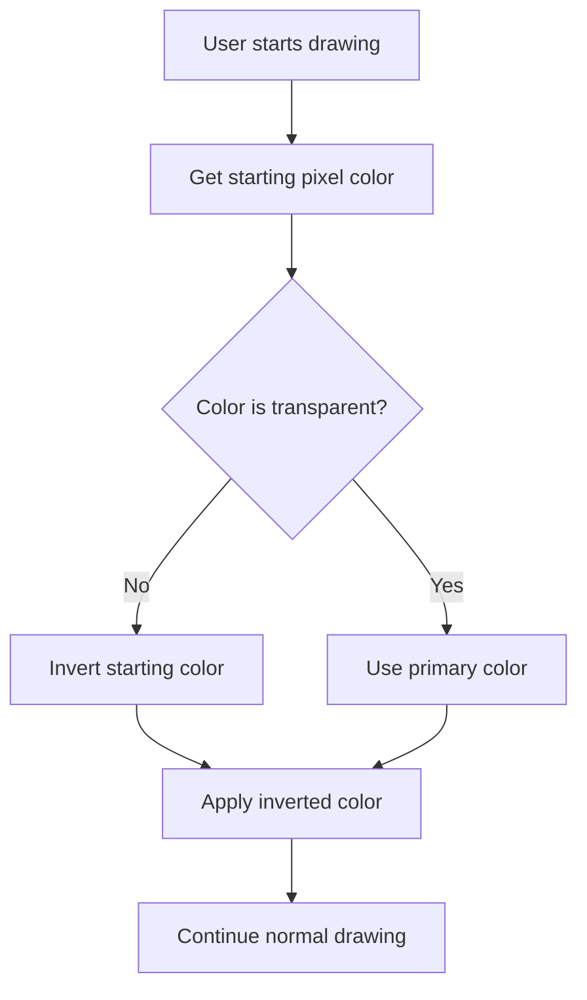

# Piskel Editor Enhancement Plan

## Overview

This document outlines the implementation plan for enhancing the Piskel editor with the requested features and improvements.

## Current Codebase Analysis

### Key Components Identified:

1. **PNG Import/Export**: `FrameUtils.js` handles transparency with `preserveOpacity` parameter
2. **Keyboard Shortcuts**: `Shortcuts.js` defines all keyboard bindings, `ShortcutService.js` handles registration
3. **Build Process**: `Gruntfile.js` and `package.json` define build pipelines using NW.js
4. **Preferences System**: `UserSettings.js` manages user preferences with localStorage
5. **Save Functionality**: Multiple storage services handle different save methods
6. **Tools System**: Tools are organized in `src/js/tools/` with shortcut bindings

## Implementation Plan

### 1. PNG Transparency Support Enhancement

**Current State**:

- `FrameUtils.createFromImage()` accepts `preserveOpacity` parameter
- `FrameUtils.removeTransparency()` converts semi-transparent pixels to fully transparent/opaque
- Import process uses `preserveOpacity` flag but defaults to false

**Enhancements Needed**:

```mermaid
graph TD
    A[PNG Import] --> B{Preserve Transparency?}
    B -->|Yes| C[Keep alpha channel intact]
    B -->|No| D[Current behavior: round to 0 or 255]
    C --> E[Smooth edges preservation]
    D --> F[Sharp edges (current)]
```

**Implementation Steps**:

1. Modify `ImportController.js` to add "Preserve Transparency" checkbox
2. Update `FrameUtils.createFromImage()` to better handle alpha blending
3. Add edge smoothing algorithm for transparency preservation
4. Update import dialog UI to show transparency options

### 2. Cross-Platform Desktop App Builds

**Current State**:

- Uses NW.js v0.48.0 (very outdated)
- Build scripts in `Gruntfile.js` for Windows, Mac, Linux
- Desktop-specific code in `FileUtilsDesktop.js`

**Enhancements Needed**:



**Implementation Steps**:

1. Research modern alternatives to NW.js (Electron, Tauri)
2. Update `package.json` dependencies
3. Create new build scripts for each platform
4. Add platform-specific configurations
5. Test on all target platforms

### 3. Future-Proofed Dependencies & Build Process

**Current Issues**:

- Outdated Grunt build system
- Old JavaScript libraries
- No modern JS features

**Modernization Plan**:

1. Migrate from Grunt to modern build tools (Vite, esbuild, or Webpack)
2. Update core dependencies:
   - jQuery 1.8.0 → jQuery 3.x or remove jQuery
   - Spectrum color picker → modern alternative
   - GIF.js → updated version
3. Add TypeScript support
4. Implement code splitting and tree shaking
5. Add automated dependency updates

### 4. Playdate-Specific Features

**Playdate Imagetable Support**:



**Implementation Steps**:

1. Add filename parsing utility for Playdate imagetable format
2. Create frame extraction logic based on filename patterns
3. Add Playdate-specific import options in UI
4. Document supported filename formats

### 5. Quality-of-Life Improvements

**Keyboard Shortcuts Enhancements**:

- Bind `Save` (Ctrl+S) to PNG export
- Add "Ignore Warnings" preference
- Disable animated preview by default
- Customizable window size/positioning
- Suppress WebKit warnings
- Modern macOS application icon

**Implementation Steps**:

1. Add new shortcuts to `Shortcuts.js`:
   ```javascript
   STORAGE: {
     SAVE_PNG: createShortcut('save-png', 'Save as PNG', 'ctrl+shift+S'),
     // ... existing
   }
   ```
2. Update `PngExportController.js` to handle keyboard shortcut
3. Add preferences to `UserSettings.js`:
   ```javascript
   IGNORE_WARNINGS: 'IGNORE_WARNINGS',
   ANIMATED_PREVIEW_ENABLED: 'ANIMATED_PREVIEW_ENABLED',
   WINDOW_SIZE: 'WINDOW_SIZE',
   WINDOW_POSITION: 'WINDOW_POSITION'
   ```
4. Update desktop app icon in `misc/desktop/`

### 6. Community-Driven Enhancements

**Outliner Tool**:

- Precise sprite/layer management
- Hierarchical view of layers/frames
- Drag-and-drop reorganization

**Dither Modifier Keys**:

- Dynamic dithering controls via keyboard
- Shift/Alt/Ctrl combinations for different patterns

**Keyboard Cursor Navigation**:

- Improved canvas traversal
- Pixel-perfect movement
- Boundary awareness

**Shift Palette Color Index Brush**:

- Cycle through palette indices with modifier keys
- Visual feedback for current index

**Default Pencil Tool**:

- Smart behavior: auto-invert starting pixel color
- Context-aware drawing
- Intuitive usage patterns

### 7. Default Pencil Tool Implementation

**Smart Pencil Behavior**:



**Implementation Steps**:

1. Create new `SmartPencilTool.js` extending base pen tool
2. Override `onMouseDown` to implement smart color logic
3. Add visual feedback for color inversion
4. Set as default tool in tool initialization

## Priority Matrix

| Feature               | Priority | Complexity | Dependencies       |
| --------------------- | -------- | ---------- | ------------------ |
| PNG Transparency      | High     | Medium     | Core import/export |
| Cross-Platform Builds | High     | High       | Build system       |
| Modern Dependencies   | High     | High       | All features       |
| Playdate Features     | Medium   | Medium     | Import system      |
| Keyboard Shortcuts    | Medium   | Low        | Shortcut system    |
| Outliner Tool         | Medium   | High       | UI system          |
| Smart Pencil          | Medium   | Medium     | Tool system        |
| Preferences           | Low      | Low        | Settings system    |

## Implementation Timeline

1. **Phase 1: Core Enhancements (Week 1-2)**

   - PNG Transparency improvements
   - Build system modernization
   - Dependency updates

2. **Phase 2: Feature Implementation (Week 3-4)**

   - Playdate-specific features
   - Quality-of-life improvements
   - Community tools

3. **Phase 3: Polish & Testing (Week 5)**
   - Cross-platform testing
   - User testing
   - Documentation

## Risk Assessment

**High Risk Items**:

- Build system migration (may break existing functionality)
- Cross-platform compatibility (testing required on all OS)
- Performance impact of transparency preservation

**Mitigation Strategies**:

- Incremental migration with fallback support
- Comprehensive test suite expansion
- Performance profiling and optimization

## Testing Strategy

1. **Unit Tests**: Expand existing test coverage
2. **Integration Tests**: Cross-feature interaction testing
3. **E2E Tests**: User workflow validation
4. **Platform Tests**: OS-specific functionality
5. **Performance Tests**: Memory/CPU usage monitoring

## Documentation Requirements

1. Update README with new features
2. Create build documentation for each platform
3. Add user guide for Playdate features
4. Document keyboard shortcut changes
5. Update contribution guidelines
